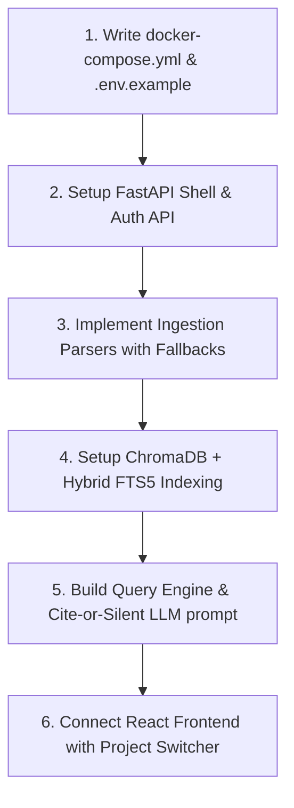

# NEXUS System Audit (Specification & Architecture)

> **Auditor**: Antigravity AI (Gemini 3.5 Flash)  
> **Date**: 2026-05-29  
> **Target**: NEXUS Repository Specification Set (Pre-Implementation Phase)  
> **Status**: **COMPLETE**

---

## 1. Repository Inventory & Code Presence

An audit of the repository files was conducted using `git ls-files`. 

**Findings**:
*   **Source Code Presence**: **0%**. There are currently no application source code files (Python, JavaScript, HTML, CSS, or Docker configuration) in the repository.
*   **Documentation & Specifications**: **100%**. The repository contains an exceptionally high-quality and internally consistent set of planning, business model, decision logs, critiques, and component specification files under the `docs/` directory.

### Context of this Audit
Since there is no active code to debug, this audit focuses on **structural blueprint analysis, implementation readiness, hidden technical risks, and architectural omissions** across the specifications of the three core layers (Ingestion, Context Store, Query) and API layer of **NEXUS**.

---

## 2. Component Blueprint Evaluation

### A. Ingestion Layer (`docs/modules/ingestion/`)
The ingestion specs are exceptionally granular, defining document-type-specific chunking strategies. However, the following gaps have been identified:

*   **PDF Parser (`pdf-parser.md`)**:
    *   *Omission*: PyMuPDF's table extraction is highly sensitive to layout. There is no fallback strategy for complex, multi-page tables (e.g. long BOM sheets printed inside PDFs).
    *   *Hidden Risk*: Two-column document layouts are read linearly by PyMuPDF by default, causing interleaved sentences. The `sort=True` flag is mentioned but is often insufficient for non-standard manuals.
*   **Excel Parser (`excel-parser.md`)**:
    *   *Omission*: Prepending column headers to row chunks is an excellent design choice. However, the spec lacks a **header detection heuristic**. If a BOM begins on line 5 instead of line 1 (common in vendor sheets), the parser will treat structural title lines as data.
*   **P&ID Parser (`pid-parser.md`)**:
    *   *Gap*: Regex extraction is limited to standard ISA 5.1 patterns. Non-standard instrumentation tags used by specific regional vendors will be missed entirely in Phase 1.
*   **WhatsApp Parser (`whatsapp-parser.md`)**:
    *   *Gap*: Chronological sliding windows do not account for parallel conversation threads. If user A and user B discuss separate technical specs simultaneously, context bleed will occur.

### B. Context Store Layer (`docs/modules/context-store/`)
*   **Vector Store (`vector-store.md`)**:
    *   *Decision Lock-in*: Embedding dimensions are locked at 1024 (`multilingual-e5-large`).
    *   *Omission*: No query-time fallback mechanism. If the Ollama embedding service is offline or slow, FastAPI queries will hang. A retry/circuit-breaker policy is missing from the spec.
*   **Conflict Resolver (`conflict-resolver.md`)**:
    *   *Hidden Risk*: The reliance on semantic similarity (>0.85) to detect contradictions is a logical fallacy. Chunks describing different properties of the same tag (e.g., *"AT-201 measures gas"* and *"AT-201 runs on 24V"*) will have high similarity but are **complementary**, not **contradictory**.
    *   *Latency Block*: Invoking the 7B LLM at query time to compare multiple pairs of retrieved chunks on CPU infrastructure will cause timeouts.

### C. Query & Response Layer (`docs/modules/query/`)
*   **Intent Detector (`intent-detector.md`)**:
    *   *Decision Mismatch*: The rule-based mapping (`ROLE_FACETS`) appends string modifiers to the query vector. This is a naive way to perform role-aware filtering and can skew the embedding vector, leading to poor semantic retrieval quality.
*   **Response Builder (`response-builder.md`)**:
    *   *Safety Concern*: Qwen2.5-7B on CPU will confabulate under high-pressure queries. The system prompt template relies entirely on system instructions to say *"I don't know"*, which is insufficient for safety-critical air-gapped operations.

### D. API Layer (`docs/modules/api/`)
*   **FastAPI Engine (`api.md`)**:
    *   *Security Gap*: The API specification lacks details on **CORS configurations**, **rate limiting**, and **request size limits** (which are critical during large PDF uploads).
    *   *JWT Secret Persistence*: The spec says `JWT_SECRET` is generated at installation and stored in `.env`. However, if the docker container regenerates this secret dynamically without a persistent volume mount for `.env`, all user sessions will be invalidated every time the container restarts.

---

## 3. Security, Privacy & Compliance Audit

NEXUS makes strong marketing claims regarding being "fully air-gapped" and secure. A security audit of the deployment blueprint exposes these vulnerabilities:

1.  **Bootstrapping in Intranets (The Air-Gap Paradox)**:
    *   The spec says `Ollama` will automatically pull Qwen2.5 and e5-large on first run (`docker-compose up`).
    *   *Vulnerability*: If the VPS is deployed in a *true* air-gapped intranet (no WAN access), the download will fail. The system must support pre-packaged offline model tarballs or local volume mounts.
2.  **No Database Encryption at Rest**:
    *   ChromaDB stores raw vector text chunks in a plain-text SQLite file inside the docker volume (`/app/data/chromadb`).
    *   *Vulnerability*: If the VPS is compromised, the entire database of engineering specs, BOMs, and WhatsApp logs can be read in plain text.
3.  **Local Network Sniffing**:
    *   NEXUS relies on Caddy/Nginx on the host for TLS. Inside the Docker network, services communicate over HTTP.
    *   *Vulnerability*: If a container in the same Docker network is compromised, internal API payloads (including JWTs and ingested docs) can be sniffed.
4.  **Role Escalation**:
    *   Authentication claims are stored directly in the JWT (`role` and `project_id`). If the token is signed with a weak or default HMAC secret, users can manipulate the token to escalate their role to `pm` or switch `project_id`.

---

## 4. Architectural Gaps & Omissions (Summary)

The following architectural items are **completely missing** from the current `docs/` blueprints:

1.  **Task Queue / Background Ingestion Worker**:
    *   Ingesting large Excel BOMs and PDFs takes substantial time and memory. If handled synchronously in the FastAPI request thread, the API will block and trigger gateway timeouts.
    *   *Solution*: Need a background worker (e.g. Celery or FastAPI BackgroundTasks) to process files asynchronously.
2.  **Database Migration Strategy**:
    *   There is no plan for schema updates in SQLite or ChromaDB collections when upgrading NEXUS from v1.0 to v1.1.
3.  **Client-Side Ingestion Feedback**:
    *   The frontend mocks a progress bar but the API spec for `/projects/{id}/ingest/status` only returns generic progress. An explicit parser error-log system is missing.
4.  **Logging & Auditing**:
    *   There is no dedicated logger specification to audit who queried what data (essential for security compliance in national infrastructure projects).

---

## 5. Mitigation & Actionable Engineering Roadmap

To ensure a highly successful Phase 1 MVP implementation, the following concrete modifications should be applied to the codebase upon creation:

### Phase 1 MVP Bootstrap Checklist



### Strategic Technical Directives

1.  **Direct-to-Disk SQLite Cache**:
    *   In Phase 1, create a standard SQLite database `nexus.db` to handle JWT blacklist tracking, project configurations, background task states, and pre-computed conflict logs.
2.  **Offline Bootstrap Support**:
    *   Provide alternative setup scripts in the setup guide:
        ```bash
        # Option A: Online Pull
        docker-compose up -d
        
        # Option B: True Offline (Air-gapped)
        docker load -i nexus-images.tar
        cp -r ./models ~/.ollama/models
        docker-compose -f docker-compose.offline.yml up -d
        ```
3.  **Strict Token Signature**:
    *   Use `HS256` with strong JWT verification middleware. Enforce automated `.env` generation containing secure random keys at the system setup level.
4.  **Hybrid SQLite FTS5 Index**:
    *   Configure hybrid query routing inside `vector_store.py` using SQLite Full-Text-Search to ensure alphanumeric instrument tags (`AT-201`) are retrieved with 100% precision.

---

## 6. Audit Verdict

*   **Verdict**: **PASS (With Warning)**
*   **Complexity Assessment**: **Low-Medium**. The engineering scope is highly realistic for a single developer. The technical critique points represent safety and edge-case mitigations, not structural showstoppers.
*   **Recommendation**: Proceed directly to **Phase 1 MVP implementation** using the bootstrap checklist outlined in Section 5. Solve Q4 and Q5 as the codebase starts to shape.
