# NEXUS — Agent Collaboration Index

> **Entry point for all AI agents and contributors.**
> Start here. Every file in this system links back to this index.

---

## What is NEXUS?

A self-hosted AI context engine for engineering project teams in SEA. Ingests WhatsApp exports, PDFs, Excel BOMs, Word SOPs, and P&ID drawings. Returns trusted, conflict-resolved, role-aware answers with source citations. Runs entirely on the client's own VPS — no cloud, no data leakage.

**Current state**: Pre-implementation. Architecture and product decisions are being finalized. No code exists yet.

**Primary market**: Indonesia, Malaysia, Philippines (EPC teams, IoT integrators, HSE compliance teams).

**Business model**: Self-hosted package sold as an annual license key.

---

## Document System Map

```mermaid
graph TD
    INDEX["📋 INDEX.md\n(you are here)"]

    INDEX --> OQ["❓ open-questions.md\n5 unresolved questions"]
    INDEX --> DEC["✅ decisions.md\nAll locked decisions + rationale"]
    INDEX --> TODO["📝 todo.md\nAll tasks by phase"]
    INDEX --> BUGS["🐛 bugs.md\nBug + issue tracker"]
    INDEX --> MOD["🧩 modules/INDEX.md\nSystem architecture + module map"]
    INDEX --> BIZ["💼 business/\nModel, market, infrastructure"]
    INDEX --> CRIT["🔍 critique/\nBusiness + technical pain points"]
    INDEX --> PLAN["📄 planning.md\nNarrative summary of all discussions"]

    MOD --> ING["ingestion/"]
    MOD --> CS["context-store/"]
    MOD --> QE["query/"]
    MOD --> API["api/"]

    ING --> WA["whatsapp-parser.md"]
    ING --> PDF["pdf-parser.md"]
    ING --> XL["excel-parser.md"]
    ING --> DOCX["docx-parser.md"]
    ING --> PID["pid-parser.md"]

    CS --> VS["vector-store.md"]
    CS --> CR["conflict-resolver.md"]
    CS --> AR["authority-ranker.md"]

    QE --> ID["intent-detector.md"]
    QE --> QEN["query-engine.md"]
    QE --> RB["response-builder.md"]

    API --> APIF["api.md"]

    BIZ --> BM["model.md"]
    BIZ --> MKT["market.md"]
    BIZ --> INF["infrastructure.md"]

    CRIT --> BC["business.md"]
    CRIT --> TC["technical.md"]
```

---

## Current State Snapshot

| Area | Status | Next action |
|------|--------|-------------|
| Product decisions | Mostly locked | Answer 5 open questions |
| Architecture design | In progress | Finalize after open questions |
| Business model | Recommended (annual license) | Confirm with builder |
| Tech stack | Partially updated | Confirm multilingual model swap |
| Implementation | Not started | Begin Phase 1 after decisions locked |
| Tests | None | Set up after first module |
| CI/CD | None | Set up with first docker-compose |

---

## How to Navigate This System (for AI agents)

1. **If you need to understand the full picture**: Read this file, then [planning.md](./planning.md)
2. **If you need to know what's undecided**: Go to [open-questions.md](./open-questions.md)
3. **If you need to know what was decided and why**: Go to [decisions.md](./decisions.md)
4. **If you need to implement something**: Go to [modules/INDEX.md](./modules/INDEX.md) → find the relevant module
5. **If you need to pick up a task**: Go to [todo.md](./todo.md)
6. **If you found a bug or issue**: Log it in [bugs.md](./bugs.md)
7. **If you need business context**: Go to [business/model.md](./business/model.md) or [business/market.md](./business/market.md)
8. **If you need to understand a design critique**: Go to [critique/](./critique/)

---

## Key Decisions at a Glance

| Decision | Chosen |
|----------|--------|
| Deployment | Self-hosted Docker Compose |
| Business model | Annual license key |
| LLM | Qwen2.5-7B (via Ollama) |
| Embedding | multilingual-e5-large |
| Vector DB | ChromaDB (one collection per project) |
| Auth | JWT with `project_id` + `role` claims |
| Target infra | DigitalOcean Singapore 16GB |
| Market | SEA — Indonesia, Malaysia, Philippines |

Full rationale: [decisions.md](./decisions.md)

---

## Open Questions (Blocking)

5 questions remain unanswered. See [open-questions.md](./open-questions.md) for full context.

| # | Question | Blocks |
|---|----------|--------|
| Q1 | WhatsApp language (Bahasa / English / mixed)? | Embedding model confirmation |
| Q2 | Distribution format (zip / Docker Hub / GitHub)? | License enforcement design |
| Q3 | One-time vs annual license? | Pricing and update model |
| Q4 | Setup service included? | Onboarding flow design |
| Q5 | Buyer: PM personally or company procurement? | Payment and sales flow |

---

## Linked Files

- [planning.md](./planning.md) — Full narrative of all product discussions
- [open-questions.md](./open-questions.md) — Unresolved questions with priority and context
- [decisions.md](./decisions.md) — All locked design decisions with rationale
- [todo.md](./todo.md) — Master task list organized by phase
- [bugs.md](./bugs.md) — Bug and issue tracker
- [modules/INDEX.md](./modules/INDEX.md) — System architecture and module specifications
- [business/model.md](./business/model.md) — Business model analysis
- [business/market.md](./business/market.md) — SEA market context and target users
- [business/infrastructure.md](./business/infrastructure.md) — VPS and deployment options
- [critique/business.md](./critique/business.md) — Business pain points
- [critique/technical.md](./critique/technical.md) — Technical pain points
