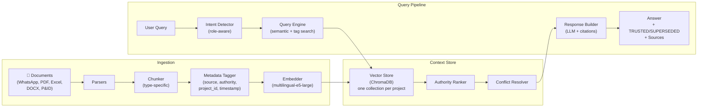
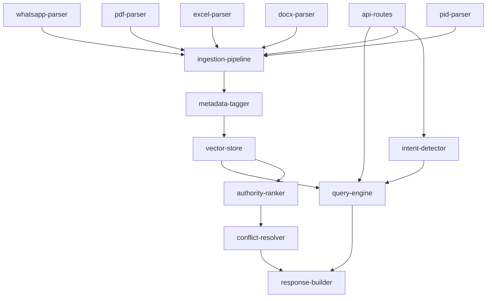

# Modules — System Architecture

> All NEXUS backend modules. Start here to understand the system design before implementing any component.

---

## System Data Flow

---

## Module Map

### Ingestion Layer

| Module | File | Status | Phase |
|--------|------|--------|-------|
| WhatsApp Parser | [ingestion/whatsapp-parser.md](./ingestion/whatsapp-parser.md) | Spec only | 1 |
| PDF Parser | [ingestion/pdf-parser.md](./ingestion/pdf-parser.md) | Spec only | 1 |
| Excel Parser | [ingestion/excel-parser.md](./ingestion/excel-parser.md) | Spec only | 1 |
| DOCX Parser | [ingestion/docx-parser.md](./ingestion/docx-parser.md) | Spec only | 1 |
| P&ID Parser | [ingestion/pid-parser.md](./ingestion/pid-parser.md) | Spec only | 1 |

### Context Store Layer

| Module | File | Status | Phase |
|--------|------|--------|-------|
| Vector Store | [context-store/vector-store.md](./context-store/vector-store.md) | Spec only | 1 |
| Conflict Resolver | [context-store/conflict-resolver.md](./context-store/conflict-resolver.md) | Spec only | 2 |
| Authority Ranker | [context-store/authority-ranker.md](./context-store/authority-ranker.md) | Spec only | 2 |

### Query Layer

| Module | File | Status | Phase |
|--------|------|--------|-------|
| Intent Detector | [query/intent-detector.md](./query/intent-detector.md) | Spec only | 3 |
| Query Engine | [query/query-engine.md](./query/query-engine.md) | Spec only | 1 |
| Response Builder | [query/response-builder.md](./query/response-builder.md) | Spec only | 1 |

### API Layer

| Module | File | Status | Phase |
|--------|------|--------|-------|
| API Routes | [api/api.md](./api/api.md) | Spec only | 1 |

---

## Module Dependency Graph

---

## Tech Stack Reference

| Component | Technology | Notes |
|-----------|-----------|-------|
| Backend framework | FastAPI (Python) | Async, OpenAPI auto-docs |
| Vector database | ChromaDB | Local, embedded, one collection per project |
| LLM | Qwen2.5-7B via Ollama | ~5GB RAM Q4_K_M; configurable via `.env` |
| Embeddings | multilingual-e5-large via Ollama | 1024 dimensions; handles Bahasa + English |
| Ingestion framework | LlamaIndex (optional) or custom pipeline | TBD based on flexibility needs |
| PDF extraction | PyMuPDF | Text + table extraction |
| Frontend | React + Tailwind CSS | |
| Auth | JWT (PyJWT) | Claims: `project_id`, `role`, `user_id`, `exp` |
| Deployment | Docker Compose | All services containerized |
