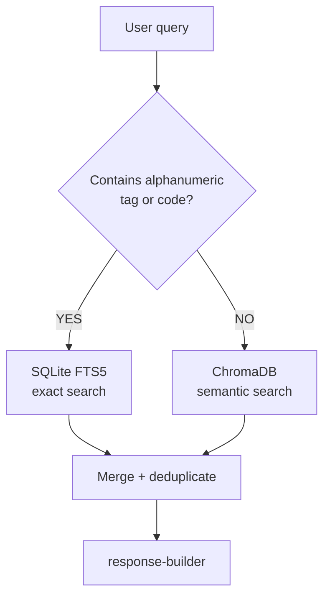

# Module: Query Engine

> `backend/query/query_engine.py`

---

## Purpose

Execute a user query against the active project's ChromaDB collection. Combines semantic search with instrument tag lookup (Phase 1). Passes results to the response builder.

---

## Inputs

| Input | Type | Description |
|-------|------|-------------|
| `query_text` | `str` | Raw user query |
| `project_id` | `str` | Active project (from JWT) |
| `role` | `str` | User role (from JWT); used by intent detector in Phase 3 |
| `n_results` | `int` | Top-k chunks to retrieve (default: 10) |

---

## Outputs

```python
@dataclass
class QueryResult:
    chunks: list[RetrievedChunk]    # Retrieved context
    instrument_tags: list[str]      # Tags detected in query
    query_text: str
    project_id: str
```

---

## Query Flow



### Step 1: Route the query

`VectorStore.hybrid_query()` handles routing automatically. The decision is based on whether the query contains an alphanumeric pattern matching instrument tags, part numbers, or reference codes (e.g. `AT-201`, `CBL-001-HV`, `PO-2024-003`).

- **Alphanumeric detected → FTS5 path**: 100% precision on exact identifiers. Dense embeddings cannot reliably distinguish `AT-201` from `AT-202` — FTS5 can.
- **Natural language → semantic path**: ChromaDB embedding search using `multilingual-e5-large`.

### Step 2: Retrieve

- **FTS5**: `VectorStore.fts_search(query_text)` — SQLite FTS5 full-text match against `instrument_tags` and `part_numbers` fields
- **Semantic**: `VectorStore.query(query_text, n_results)` — embed query, find top-k cosine-similar chunks in ChromaDB

### Step 3: Merge and deduplicate

Combine results from both paths. Remove duplicates by `chunk_id`. FTS5-matched chunks rank above semantic-only matches in the merged list.

---

## Phase Progression

| Phase | What changes |
|-------|-------------|
| 1 | Semantic search + tag lookup. No re-ranking. |
| 2 | Results passed to authority ranker → conflict resolver before response |
| 3 | Intent detector modifies query and filters based on user role |

---

## Related

- [intent-detector.md](./intent-detector.md)
- [response-builder.md](./response-builder.md)
- [../context-store/vector-store.md](../context-store/vector-store.md)
- [../../decisions.md → D09](../../decisions.md)
