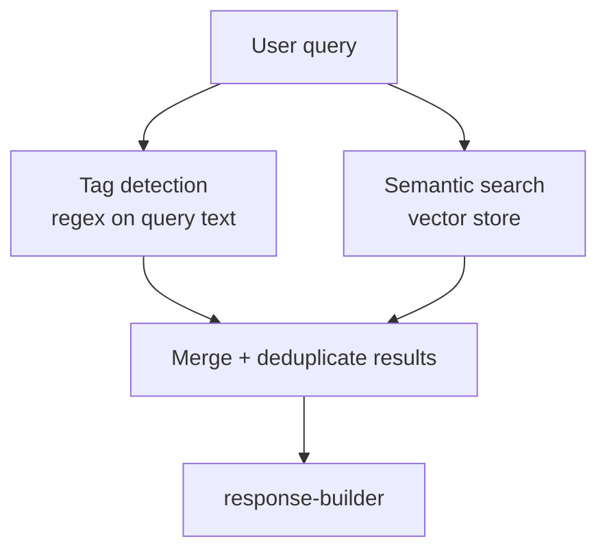

# Module: Query Engine

> `backend/query/query_engine.py`

---

## Purpose

Execute a user query against the active project's ChromaDB collection. Combines semantic search with instrument tag lookup (Phase 1). Passes results to the response builder.

---

## Inputs

| Input | Type | Description |
|-------|------|-------------|
| `query_text` | `str` | Raw user query |
| `project_id` | `str` | Active project (from JWT) |
| `role` | `str` | User role (from JWT); used by intent detector in Phase 3 |
| `n_results` | `int` | Top-k chunks to retrieve (default: 10) |

---

## Outputs

```python
@dataclass
class QueryResult:
    chunks: list[RetrievedChunk]    # Retrieved context
    instrument_tags: list[str]      # Tags detected in query
    query_text: str
    project_id: str
```

---

## Query Flow



### Step 1: Tag detection in query

Check if the query contains instrument tag patterns (AT-201, FT-101, etc.).

If tags found:
- Run `VectorStore.query_by_tag(tag)` for each detected tag (exact match on metadata)
- Merge tag-matched chunks with semantic search results
- Tag-matched chunks get a retrieval boost (rank near top)

### Step 2: Semantic search

Embed the query using the same `multilingual-e5-large` model used at ingestion. Query the active project's ChromaDB collection for top-k results.

### Step 3: Merge and deduplicate

Combine tag-matched and semantic results. Remove duplicates by `chunk_id`. Return unified list.

---

## Phase Progression

| Phase | What changes |
|-------|-------------|
| 1 | Semantic search + tag lookup. No re-ranking. |
| 2 | Results passed to authority ranker → conflict resolver before response |
| 3 | Intent detector modifies query and filters based on user role |

---

## Related

- [intent-detector.md](./intent-detector.md)
- [response-builder.md](./response-builder.md)
- [../context-store/vector-store.md](../context-store/vector-store.md)
- [../../decisions.md → D09](../../decisions.md)
