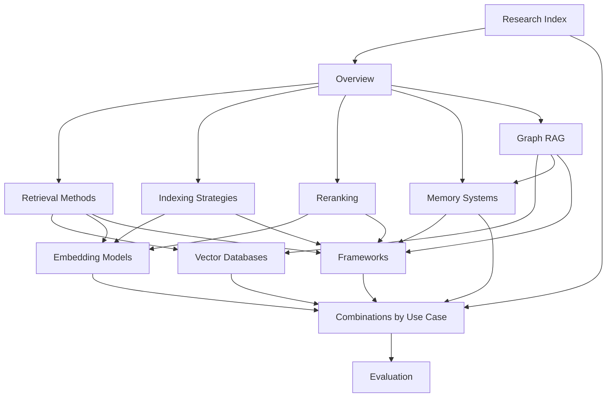

# Context Engine Research — Index

> **Scope**: General-purpose context engine systems — state of the art as of 2025–2026.
> Not specific to NEXUS or EPC. Applicable to any domain.

This research covers every layer of a production context engine: retrieval, indexing, reranking, graph augmentation, memory, embeddings, vector storage, orchestration, and evaluation.

---

## Graph Overview

---

## File Map

| File | Contents | Maturity |
|------|----------|----------|
| [[overview]] | What a context engine is vs. RAG, search, KB | High |
| [[retrieval]] | Dense, sparse, hybrid RRF, ColBERT, multi-vector | High |
| [[indexing]] | Fixed-size, semantic, contextual retrieval, hierarchical | High |
| [[reranking]] | Cross-encoders, LLM-as-reranker, model comparison table | High |
| [[graph-rag]] | Microsoft GraphRAG, LightRAG, LlamaIndex, Graphiti | Medium |
| [[memory]] | Memory taxonomy, MemGPT/Letta, Mem0, Zep | Medium-High |
| [[embeddings]] | Model comparison table, multilingual, code, multimodal | High |
| [[vector-databases]] | Qdrant, Pinecone, Weaviate, Milvus, pgvector benchmarks | High |
| [[frameworks]] | LlamaIndex, LangChain, LangGraph, Haystack, DSPy | High |
| [[combinations]] | Best stack by use case (enterprise, legal, code, EPC…) | High |
| [[evaluation]] | RAGAS, ARES, TruLens, DeepEval, what matters in prod | High |

---

## Quick Reference: Technology Maturity Matrix

| Component | Maturity | Production-ready? | Notes |
|-----------|----------|-------------------|-------|
| Hybrid retrieval (BM25 + dense + RRF) | High | ✅ Yes | Default first choice |
| Contextual Retrieval (Anthropic) | High | ✅ Yes | Requires prompt caching for cost |
| Hierarchical indexing | High | ✅ Yes | Parent-doc retriever |
| Cross-encoder reranking | High | ✅ Yes | Highest-ROI single addition |
| ColBERT / late interaction | Medium | ✅ Yes | Needs storage planning |
| Microsoft GraphRAG | Medium | ⚠️ With cost controls | $33K to index 5GB legal docs |
| LightRAG | Medium | 🔄 Emerging | Lower cost GraphRAG alternative |
| MemGPT / Letta | Medium | ✅ Yes | For long-running agents |
| Mem0 hybrid memory | Medium-High | ✅ Yes | Production deployments exist |
| DSPy prompt optimization | Medium | ⚠️ Observability gaps | Not fully production-ready |
| LLM-as-reranker | Medium | ⚠️ Async/batch only | Too slow for sync pipelines |
| Multimodal embeddings | Low-Medium | 🔄 Early production | Cohere embed-v4 leads |
| Real-time index updates | Low | ❌ Engineering-intensive | Significant open problem |
| Cache-Augmented Generation (CAG) | Low | ⚠️ Static corpora only | Hot-cache approach |

---

## Key Numbers to Remember

| Metric | Number | Source |
|--------|--------|--------|
| Hybrid RRF vs. best single method | **+580% relative Recall@10** | MS MARCO benchmark |
| Contextual Retrieval failure rate reduction | **35–67%** | Anthropic, Sep 2024 |
| GraphRAG answer comprehensiveness vs. vector RAG | **+50–70%** on global queries | Microsoft Research |
| GraphRAG indexing cost (5GB legal, GPT-4) | **$33,000** | Production case study |
| Reranking top model ELO (Zerank 2) | **1638** | Agentset leaderboard, 2026 |
| Best open MTEB score (Microsoft Harrier-OSS-v1, 27B) | **74.3** (MTEB v2) | MTEB leaderboard, 2026 |
| LangChain vs. Haystack latency overhead | 10ms vs. 5.9ms | Framework benchmark 2025 |

---

## Related

- [[../INDEX|NEXUS Master Index]]
- [[combinations|Best Stack by Use Case]] — practical decision guide
- [[../modules/context-store/vector-store|NEXUS Vector Store Spec]]
- [[../decisions|NEXUS Decision Log]]
